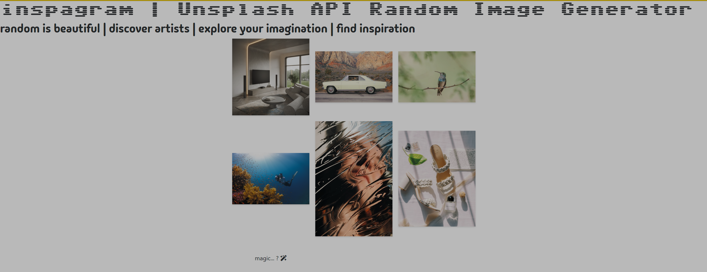

# @inspagram : Using the Unsplash API with JavaScript & React 🔬

[@inspagram](https://inspagram.netlify.app/) is a simple web application that mimics the style of Instagram by displaying random images from the Unsplash API. This project was created to explore integrating the Unsplash API with JavaScript and React.

[](https://inspagram.netlify.app/)

## Features

- **Random Image Display:** The application fetches random images from the Unsplash API and displays them in a grid format, similar to Instagram.
- **Image Reload:** Users can reload images at any time by clicking on the "magic?" button.
- **Responsive Layout:** The layout is responsive and automatically adjusts to the user's screen size thanks to Bootstrap.

## Project Structure

- **`src/App.js`:** This is the main component of the application where everything starts. It displays the title, username, and the `PhotoGallery` component.
- **`src/components/PhotoGallery.jsx`:** This is the heart of the application. It uses the Unsplash API to load and display random images in a grid.
- **`src/api/unsplash.js`:** A utility file that contains the Unsplash API configuration and functions for making requests.
- **`src/PhotoGallery.css`:** The custom CSS file that defines the style of the photo gallery.

## Project Setup

1. **Project Cloning:** Clone this repository to your local machine using the command `git clone https://github.com/ikramagic/inspagram.git`.

2. **Dependency Installation:** Install the dependencies using `npm install`.

3. **Obtaining the Unsplash API Key:** To use the Unsplash API, you must create a developer account on [Unsplash Developer](https://unsplash.com/developers) and obtain an API key.

4. **API Key Configuration:** Create a `.env` file at the root of the project and add your API key as follows:

```bash
REACT_APP_UNSPLASH_API_KEY=YOUR_UNSPLASH_API_KEY_HERE
```

5. **Starting the Application:** Start the application with `npm start`. You can now view the application in your browser by opening [your local server](http://localhost:3000).

You can also check out the app online here: [🌍](https://inspagram.netlify.app/).

## Customization

The @inspagram application is a starting point for further exploring the use of the Unsplash API and React. Here are some ideas to enrich the application:

- **Image Search:** Add a search function to allow users to search for specific images by keywords.
- **Displaying Users:** Integrate the Unsplash Users API to display details of the user associated with each image.
- **Pagination:** Implement pagination to display more images at once.

## Contribution

Contributions are welcome! If you have ideas for improvements, new features, or fixes to this project, feel free to submit pull requests.

## Who did this ?

[Ikrame Saadi](https://github.com/ikramagic/)

## License

This project is licensed under the [MIT License](LICENSE.md).

## Status

 

[](https://app.netlify.com/sites/inspagram/deploys)

# (🇫🇷) @inspagram - Utiliser l'API Unsplash avec JavaScript & React 🔬

[@inspagram](https://inspagram.netlify.app/) est une application web simple qui imite le style d'Instagram en affichant des images aléatoires de l'API Unsplash. Ce projet a été créé pour explorer l'intégration de l'API Unsplash avec JavaScript et React, et il peut être utilisé comme base pour développer des fonctionnalités plus avancées.

## Fonctionnalités

- **Affichage d'images aléatoires :** L'application récupère des images aléatoires à partir de l'API Unsplash et les affiche sous forme de grille, similaire à Instagram.
- **Rechargement d'images :** Les utilisateurs peuvent recharger les images à tout moment en cliquant sur le bouton "magic?".
- **Mise en page responsive :** La mise en page est responsive et s'adapte automatiquement à la taille de l'écran de l'utilisateur grâce à Bootstrap.

## Structure du projet

- **`src/App.js` :** C'est le composant principal de l'application où tout commence. Il affiche le titre, le nom d'utilisateur et le composant `PhotoGallery`.
- **`src/components/PhotoGallery.jsx` :** C'est le cœur de l'application. Il utilise l'API Unsplash pour charger et afficher les images aléatoires dans une grille.
- **`src/api/unsplash.js` :** Un fichier utilitaire qui contient la configuration de l'API Unsplash et des fonctions pour effectuer des requêtes.
- **`src/PhotoGallery.css` :** Le fichier CSS personnalisé qui définit le style de la galerie de photos.

## Configuration du projet

1. **Clonage du projet :** Clonez ce dépôt sur votre machine locale en utilisant la commande `git clone https://github.com/ikramagic/inspagram.git`.

2. **Installation des dépendances :** Installez les dépendances en utilisant `npm install`.

3. **Obtention de la clé API Unsplash :** Pour utiliser l'API Unsplash, vous devez créer un compte développeur sur [Unsplash Developer](https://unsplash.com/developers) et obtenir une clé API.

4. **Configuration de la clé API :** Créez un fichier `.env` à la racine du projet et ajoutez votre clé d'API comme suit :

```bash
REACT_APP_UNSPLASH_API_KEY=VOTRE_CLÉ_API_UNSPLASH_ICI
```

5. **Démarrage de l'application :** Démarrez l'application avec `npm start`. Vous pouvez maintenant visualiser l'application dans votre navigateur en ouvrant [votre serveur local](http://localhost:3000).

Vous pouvez aussi consulter l'app en lgne ici : [🌍](https://inspagram.netlify.app/).

## Personnalisation

L'application @inspagram est un point de départ pour explorer davantage l'utilisation de l'API Unsplash et de React. Voici quelques idées pour enrichir l'application :

- **Recherche d'images :** Ajoutez une fonction de recherche pour permettre aux utilisateurs de rechercher des images spécifiques par mots-clés.
- **Affichage d'utilisateurs :** Intégrez l'API Unsplash Users pour afficher les détails de l'utilisateur associé à chaque image.
- **Pagination :** Mettez en place une pagination pour afficher plus d'images à la fois.

## Contribution

Les contributions sont les bienvenues ! Si vous avez des idées d'amélioration, de nouvelles fonctionnalités ou des correctifs à apporter à ce projet, n'hésitez pas à soumettre des pull requests.

## Auteur

[Ikrame Saadi (@ikramagic)](https://github.com/ikramagic/)

## Licence

Ce projet est sous licence [MIT](LICENSE.md).

## Statut 

 

[](https://app.netlify.com/sites/inspagram/deploys)
